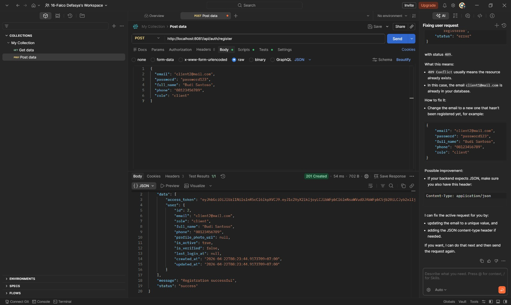
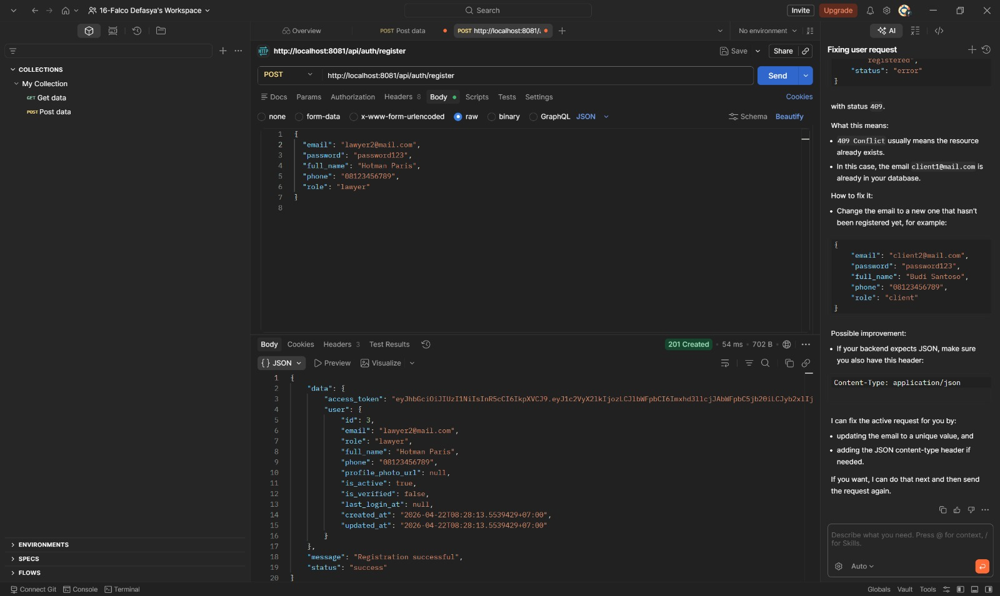
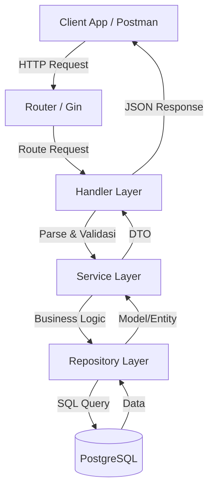
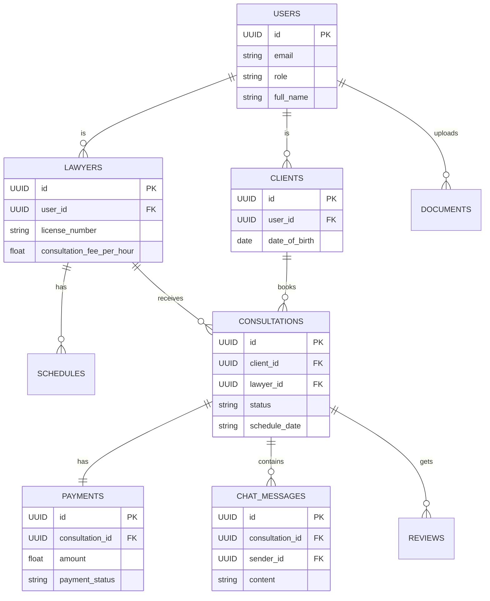

# Legal Consultation API

REST API backend untuk platform konsultasi hukum berbasis web, dibangun dengan **Go + Gin** menggunakan **Clean Architecture**.

## 📸 Dokumentasi & Alur Sistem

Berikut adalah beberapa tampilan alur sistem dari API ini berdasarkan *use case*:

### Autentikasi
- **Login Client**: 
- **Login Lawyer**: 

### Dashboard & Profil
- **Client Dashboard**: 
- **Lawyer Dashboard**: 

### Alur Konsultasi & Pencarian
- **List & Cari Lawyer (Tanpa Token)**: .jpeg)
- **Booking Konsultasi**: .jpeg)
- **Tabel Profil & Pencarian Lawyer**: .jpeg)

### Pembayaran & Riwayat
- **Upload Bukti Transfer (Wajib Token)**: .jpeg)
- **Cek Status Tagihan Pembayaran (Wajib Token)**: .jpeg)
- **Lihat Riwayat Konsultasi Saya (Wajib Token)**: .jpeg)
- **Batalkan Konsultasi (Wajib Token)**: .jpeg)

---

## 📐 Arsitektur Sistem (UML & Flow)

Berikut adalah visualisasi arsitektur dan alur sistem. (GitHub sudah mendungkung native format Mermaid `mermaid` sehingga diagram langsung terlihat).

### 1. Arsitektur Clean Architecture
Alur komunikasi antara layer dalam arsitektur backend.

*Penjelasan*: Permintaan dari klien masuk melalui Router, diteruskan ke Handler untuk validasi input. Handler memanggil Service yang memproses logika bisnis. Jika butuh data, Service memanggil Repository yang berinteraksi langsung dengan Database.

### 2. Entity Relationship Diagram (ERD)
Struktur database dan relasi antar entitas.

*Penjelasan*: `USERS` adalah tabel utama (bisa sebagai Client atau Lawyer). Klien dapat melakukan `CONSULTATIONS` (pemesanan konsultasi) ke Lawyer. Setiap Konsultasi memiliki 1 `PAYMENTS` dan bisa berisi banyak `CHAT_MESSAGES` (jika live chat) dan diakhiri dengan 1 `REVIEWS`.

### 3. Use Case Diagram
Fitur-fitur utama yang dapat diakses oleh setiap aktor.
```mermaid
flowchart LR
    %% Actors
    C((Client))
    L((Lawyer))
    A((Admin))

    %% Use Cases
    subgraph System[Sistem Konsultasi Hukum]
        Register(Registrasi & Login)
        Search(Cari Lawyer)
        Book(Booking Konsultasi)
        Pay(Upload Bukti Pembayaran)
        Verify(Verifikasi Pembayaran)
        Chat(Chatting/Konsultasi)
        Review(Beri Ulasan)
        Schedule(Atur Jadwal)
    end

    C --> Register
    L --> Register
    C --> Search
    C --> Book
    C --> Pay
    A --> Verify
    C --> Chat
    L --> Chat
    C --> Review
    L --> Schedule

### 4. Class Diagram
Struktur class/model utama dan method-method penting dalam domain bisnis.
```mermaid
classDiagram
    class User {
        +UUID id
        +String email
        +String role
        +String full_name
        +login()
        +register()
    }
    class Lawyer {
        +UUID id
        +String license_number
        +float consultation_fee_per_hour
        +updateProfile()
        +setAvailability()
    }
    class Client {
        +UUID id
        +Date date_of_birth
        +String address
    }
    class Consultation {
        +UUID id
        +String status
        +String schedule_date
        +String case_description
        +book()
        +confirm()
        +complete()
        +cancel()
    }
    class Payment {
        +UUID id
        +float amount
        +String payment_status
        +uploadProof()
        +verify()
    }
    class ChatMessage {
        +UUID id
        +String content
        +String message_type
        +sendMessage()
    }
    class Review {
        +UUID id
        +int rating
        +String comment
        +createReview()
    }

    User <|-- Lawyer : extends
    User <|-- Client : extends
    Client "1" -- "0..*" Consultation : books
    Lawyer "1" -- "0..*" Consultation : receives
    Consultation "1" *-- "1" Payment : has
    Consultation "1" *-- "0..*" ChatMessage : contains
    Consultation "1" *-- "1" Review : gets
```
*Penjelasan*: Class Diagram ini menunjukkan pewarisan (inheritance) dimana Lawyer dan Client merupakan perpanjangan (extends) dari User. Relasi komposisi/agregasi juga terlihat jelas di mana sebuah Konsultasi memiliki Pembayaran, Pesan Chat, dan Ulasan.
```
*Penjelasan*: 
- **Client**: Bisa mencari pengacara, melakukan pemesanan (booking), mengunggah bukti pembayaran, melakukan konsultasi (chat), dan memberikan ulasan.
- **Lawyer**: Bisa mengatur jadwal ketersediaannya, merespons chat konsultasi dari klien.
- **Admin**: Bertugas memverifikasi bukti pembayaran yang diunggah oleh klien.

---

## 🏗️ Struktur Proyek

```
legal-consultation-api/
├── uts_ppt/
│   ├── cmd/api/main.go                  # Entrypoint
│   ├── internal/
│   │   ├── config/config.go             # Konfigurasi aplikasi
│   │   ├── database/database.go         # Koneksi PostgreSQL
│   │   ├── models/models.go             # Domain models
│   │   ├── repository/                  # Layer data access
│   │   ├── service/                     # Business logic layer
│   │   ├── handler/                     # HTTP handlers
│   │   ├── middleware/middleware.go     # Auth, CORS, Logging
│   │   └── router/router.go             # Route definitions
│   ├── pkg/                             # Helper & Utilities (JWT, Response)
│   ├── migrations/001_init_schema.sql   # Database migration
│   ├── .env.example
│   └── go.mod
```

## 🚀 Cara Menjalankan

### 1. Prerequisites
- Go 1.21+
- PostgreSQL 14+

### 2. Setup Database
```bash
psql -U postgres -c "CREATE DATABASE legal_consultation_db;"
psql -U postgres -d legal_consultation_db -f uts_ppt/migrations/001_init_schema.sql
```

### 3. Konfigurasi Environment
```bash
cd uts_ppt
copy .env.example .env
# Edit .env sesuai konfigurasi lokal Anda
```

### 4. Install Dependencies & Run
```bash
go mod tidy
go run main.go
```

Server berjalan di: `http://localhost:8080`

---

## 📋 API Endpoints Utama

### Auth
| Method | Endpoint | Deskripsi | Auth |
|--------|----------|-----------|------|
| POST | `/api/auth/register` | Daftar akun baru | ❌ |
| POST | `/api/auth/login` | Login | ❌ |
| GET | `/api/profile` | Lihat profil | ✅ |

### Lawyers
| Method | Endpoint | Deskripsi | Auth |
|--------|----------|-----------|------|
| GET | `/api/lawyers` | Cari lawyer (filter) | ❌ |
| GET | `/api/lawyers/:id` | Detail lawyer | ❌ |
| POST | `/api/lawyers/profile` | Buat profil lawyer | ✅ Lawyer |
| POST | `/api/schedules` | Tambah jadwal | ✅ Lawyer |

### Consultations
| Method | Endpoint | Deskripsi | Auth |
|--------|----------|-----------|------|
| POST | `/api/consultations` | Booking konsultasi | ✅ Client |
| GET | `/api/consultations` | Riwayat konsultasi | ✅ |
| PATCH | `/api/consultations/:id/cancel` | Batalkan | ✅ |
| POST | `/api/consultations/:id/reviews` | Beri ulasan | ✅ Client |

### Payments
| Method | Endpoint | Deskripsi | Auth |
|--------|----------|-----------|------|
| GET | `/api/consultations/:id/payment` | Info pembayaran | ✅ |
| POST | `/api/payments/:id/upload` | Upload bukti bayar | ✅ |

### Chat
| Method | Endpoint | Deskripsi | Auth |
|--------|----------|-----------|------|
| GET | `/api/consultations/:id/ws` | WebSocket real-time | ✅ |

---

## 📦 Contoh Request/Response

### Register
```json
POST /api/auth/register
{
  "email": "client@example.com",
  "password": "Password123!",
  "full_name": "Budi Santoso",
  "phone": "081234567890",
  "role": "client"
}
```

### Book Consultation
```json
POST /api/consultations
Authorization: Bearer <token>
{
  "lawyer_id": "uuid-lawyer",
  "schedule_date": "2024-05-10",
  "start_time": "09:00",
  "end_time": "10:00",
  "duration_hours": 1,
  "case_description": "Saya membutuhkan konsultasi...",
  "case_type": "Perdata",
  "platform": "chat"
}
```
